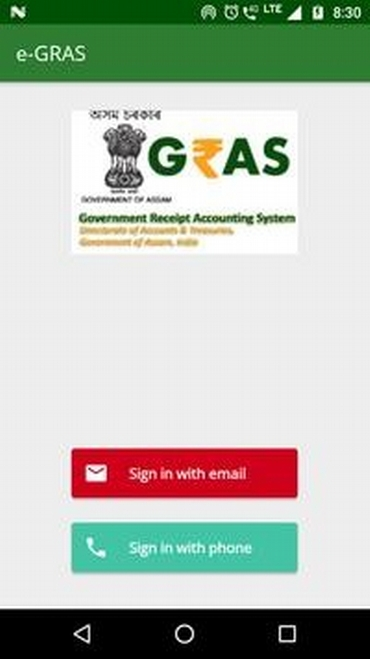
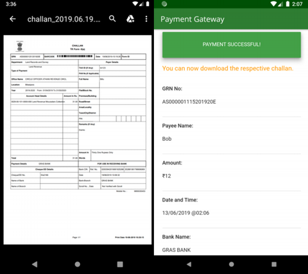

# e-GRAS Mobile
This is an Android front-end application designed to interact with e-GRAS,
which is a government's electronic payment gateway for online tax payments and
challan generation. Besides, the application lets users review their transaction
history and search for already generated challans.

### Some snapshots of the App
|  |  |  
| ----------- | ----------- |  
|  |  |
|  |  |
|  |  |
|  |
